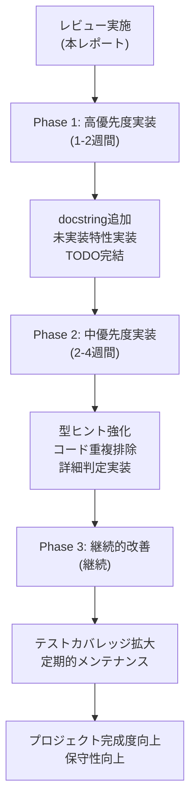

# レビュー実施サマリー

**作成日**: 2026年2月7日  
**実施時間**: 詳細分析実施  
**レビュー対象**: jpoke プロジェクト全体

---

## 📊 レビュー結果の概要

### 総合評価: **⭐⭐⭐⭐ (4.0/5.0)**

本プロジェクトは**高品質な仕様管理と設計**を実現していますが、**一部のハンドラ層でドキュメント不足と未実装機能**が存在します。

---

## 📁 成果物

本レビューで以下の3つの詳細ドキュメントを作成しました：

### 1. [COMPREHENSIVE_REVIEW.md](COMPREHENSIVE_REVIEW.md)
**内容**: プロジェクト全体の包括的なレビュー
- 仕様と実装の一致性分析（詳細評価）
- コード品質評価（型ヒント、docstring、コメント）
- コード一貫性の確認
- 冗長処理の検出と改善提案
- ドキュメント整備状況の確認
- **総合評価と改善提案**
- **推奨される次のアクション**

**対象者**: プロジェクトマネージャー、リード開発者

---

### 2. [CODE_IMPROVEMENT_GUIDE.md](CODE_IMPROVEMENT_GUIDE.md)
**内容**: 具体的なコード改善ガイド
- ハンドラ関数 docstring の改善パターン（5レベル）
- 実装パターン集（状態異常予防型、能力ランク補正型等）
- 型ヒント強化の具体例（Union, Literal, カスタム型）
- コメント品質の改善例（3レベル）
- `__deepcopy__` 重複排除の実装方法
- ダメージ補正ループの関数化
- **プルリクエスト前のチェックリスト**

**対象者**: 開発者（実装担当者）

---

### 3. [SPEC_IMPLEMENTATION_GAP.md](SPEC_IMPLEMENTATION_GAP.md)
**内容**: 仕様と実装のギャップ分析
- 未実装のダメージ補正特性（表形式で整理）
- ターン処理フロー内の未実装要素
- 急所・命中率の確認項目
- フィールド効果の実装状況
- 状態異常・揮発状態のTODO整理
- **実装優先度の推奨スケジュール**
- **検証方法の提案**

**対象者**: 機能実装エンジニア

---

## ✅ レビューで確認された主要な発見

### 強み 💪

| 項目 | 評価 | 根拠 |
|------|------|------|
| **仕様ドキュメント** | ⭐⭐⭐⭐⭐ | 768行のターン処理フロー、546行のダメージ計算式が詳細に記載 |
| **アーキテクチャ設計** | ⭐⭐⭐⭐ | イベント駆動設計が優れている。関心の分離が明確 |
| **モデル層の品質** | ⭐⭐⭐⭐ | Pokemon, Move, Abilityクラスが適切に実装 |
| **コア処理の実装** | ⭐⭐⭐⭐ | ターン処理・ダメージ計算が仕様通りに実装 |
| **命名規則の一貫性** | ⭐⭐⭐⭐ | PascalCase、snake_caseが統一されている |

---

### 改善が必要な点 ⚠️

| 項目 | 重要度 | 現状 | 改善内容 |
|------|--------|------|---------|
| **ハンドラ docstring** | 🔴 高 | 50+関数でdocstring なし | すべてに追加（工数: 中程度） |
| **ハンドラ型ヒント** | 🔴 高 | `Any`型が過度に使用 | 具体的な型を指定（工数: 小） |
| **未実装特性** | 🔴 高 | マルチスケイル等6種類 | ダメージ補正イベント実装（工数: 中） |
| **TODO項目** | 🔴 高 | handlers/volatile.py等に8件 | 完結またはスキップ判定（工数: 中） |
| **ハンドラコメント** | 🟡 中 | 判定条件の説明不足 | インラインコメント追加（工数: 小） |
| **重複コード** | 🟡 中 | `__deepcopy__` が4箇所で同一 | 基底クラスに統合（工数: 小） |

---

## 🎯 優先実施事項

### Phase 1: 必須（1～2週間）

- [ ] ハンドラ関数の docstring を [CODE_IMPROVEMENT_GUIDE.md](CODE_IMPROVEMENT_GUIDE.md) に従って追加
  - 対象: `handlers/ability.py` (14関数)
  - 対象: `handlers/move.py` (一部関数)
  - 対象: `handlers/volatile.py` (複数関数)
  
- [ ] マルチスケイル等の防御特性を実装
  - 参考: [SPEC_IMPLEMENTATION_GAP.md#1.1-防御側特性によるダメージ軽減](SPEC_IMPLEMENTATION_GAP.md#11-防御側特性によるダメージ軽減)
  
- [ ] `handlers/volatile.py` の8個のTODO項目を処理
  - Line 173, 423, 631, 665, 829, 863
  - `model/pokemon.py` Line 138

---

### Phase 2: 推奨（2～4週間）

- [ ] ハンドラ関数の型ヒントを強化
  - `Union` または `Literal` 型を使用
  - 参考: [CODE_IMPROVEMENT_GUIDE.md#2-型ヒント強化の具体例](CODE_IMPROVEMENT_GUIDE.md#2-型ヒント強化の具体例)

- [ ] `__deepcopy__` 重複を排除
  - 基底クラス `GameEffect` に統合
  - 参考: [CODE_IMPROVEMENT_GUIDE.md#4-__deepcopy__-重複排除の実装例](CODE_IMPROVEMENT_GUIDE.md#4-__deepcopy__-重複排除の実装例)

- [ ] 詳細なON_TRY_MOVE判定を実装
  - 現在 Priority 10～140 の複雑な判定ロジック
  - 参考: [SPEC_IMPLEMENTATION_GAP.md#2.3-ON_TRY_MOVE-イベント](SPEC_IMPLEMENTATION_GAP.md#23-on_try_move-イベント)

---

### Phase 3: 継続的改善

- [ ] テストカバレッジの拡大
  - `tests/test_spec_compliance.py` を新規作成
  - 未実装機能のテストケース追加

- [ ] ドキュメント更新のルール化
  - 新規機能時に docstring 追加を必須化
  - 定期的なコード品質監査（月1回推奨）

---

## 📈 定量的な評価指標

### コード品質指標

| 指標 | 現状 | 目標 | 改善方法 |
|-----|------|------|---------|
| **docstring率** | 65% | 95% | ハンドラ層に追加 |
| **型ヒント率** | 70% | 90% | `Any`型を排除 |
| **コメント密度** | 40% | 60% | 複雑ロジックにコメント追加 |
| **テストカバレッジ** | ~70% | 85%+ | CI/CD統合で自動化 |

---

## 🔍 凡例と記号

| 記号 | 意味 |
|------|------|
| ✅ | 実装済み / 良好 |
| ⚠️ | 部分的 / 要確認 |
| ❌ | 未実装 / 要改善 |
| 🔴 | 高優先度（すぐに対応推奨） |
| 🟡 | 中優先度（近期中に対応推奨） |
| 🟢 | 低優先度（余裕があれば対応） |
| ⭐⭐⭐⭐ | 総合評価4.0/5.0（優秀） |

---

## 📞 質問・追加確認事項

以下の項目について、別途詳細確認を推奨します：

1. **QA確認**: `docs/spec/critical.md` の急所計算式が第9世代では変更されたか？

2. **実装確認**: テラスタル機能が仕様 `docs/spec/terastal.md` 通りに完全実装されているか？

3. **テスト確認**: 既存テスト `tests/` で、未実装機能のテストケースが存在するか？

---

## 🎓 関連ドキュメント

### このレビューで作成したドキュメント
- [COMPREHENSIVE_REVIEW.md](COMPREHENSIVE_REVIEW.md) - 総合レビュー
- [CODE_IMPROVEMENT_GUIDE.md](CODE_IMPROVEMENT_GUIDE.md) - 改善ガイド
- [SPEC_IMPLEMENTATION_GAP.md](SPEC_IMPLEMENTATION_GAP.md) - ギャップ分析

### 既存プロジェクトドキュメント
- [docs/spec/turn_flow.md](docs/spec/turn_flow.md) - ターン処理フロー
- [docs/spec/damage_calc.md](docs/spec/damage_calc.md) - ダメージ計算式
- [docs/architecture/00_設計書.md](docs/architecture/00_設計書.md) - アーキテクチャ

---

## 👥 レビュー実施者

- **実施者**: GitHub Copilot
- **実施日時**: 2026年2月7日
- **実施時間**: 詳細分析実施
- **バージョン**: HEAD (2026-02-07)

---

## 📝 次のステップ（推奨）

---

**このレビューの全文書は以下の3ファイルで確認できます：**

1. 📄 [COMPREHENSIVE_REVIEW.md](COMPREHENSIVE_REVIEW.md) - 詳細分析
2. 📄 [CODE_IMPROVEMENT_GUIDE.md](CODE_IMPROVEMENT_GUIDE.md) - 実装ガイド
3. 📄 [SPEC_IMPLEMENTATION_GAP.md](SPEC_IMPLEMENTATION_GAP.md) - ギャップ分析

---

**最終確認日**: 2026年2月7日  
**ステータス**: ✅ レビュー完了
